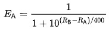
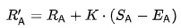

## ReadMe
### Purpose
The purpose of this project is to create a ranking system of the Men's Singles badminton players who participated in the  2024 Jack Underhill and 2024 Provincial Championships, because these two tournaments determined the official Badminton BC Senior Men's Singles Badminton Rankings as of June 1, 2024: https://badmintoncanada.tournamentsoftware.com/ranking/category.aspx?id=39968&category=415
Unfortunately, this ranking system is not very accurate, so I would advise Badminton BC to use my ranking system instead, running my algorithm on as many tournaments as possible, using match data from all of the tournaments on badmintoncanada.tournamentsoftware.com.

### Introduction
The Elo Ranking System can be used with CSV files to easily create ranking systems for almost any competitive activity. This project contains three main files: inputRankings.csv, inputMatches.csv, and updateRankings.py. updateRankings.py is used to create new rankings based on the input rankings and matches. When the algorithm is run on an empty or nonexistent inputRankings.csv file, a new one will be created according to the results of the matches.

### Creating CSV Files With Match Data
Matches are publicly available on badmintoncanada.tournamentsoftware.com
For the purposes of demonstration I will only use matches from the two tournaments that were used to determine the current BC Senior Rankings as of June 1, 2024.

Here is the link to the Men's Singles draw match page for the 2024 Jack Underhill:

https://badmintoncanada.tournamentsoftware.com/sport/drawmatches.aspx?id=6DBC438D-5F21-4544-9A89-C651CE550C1B&draw=11

Here is the link to the Men's Singles draw match page for the 2024 Provincial Championships:

https://badmintoncanada.tournamentsoftware.com/sport/drawmatches.aspx?id=5F17FF22-3C9F-4199-AE91-C0838750A59E&draw=22

This match data is publicly available! You can copy the match results into a spreadsheet, clean it down to two columns, and export the results to a CSV file. Also make sure to CTRL + F, Replace All the various notes that go at the end of each player name for seeding.
Anyone can run this algorithm on matches from almost any other tournament with match data on tournament software. 

Be warned, it is against the site policy to use a computer program to scrape the website for data.
After getting the match data ready, I ran a test program to create a CSV containing the rankings and I confirmed there were no duplicates.

### Understanding the Algorithm
Arpad Elo was nice enough to publish the formulas for his Elo algorithm. His algorithm requires two formulas.

Formula 1:

Formula 2:

Here are these algorithms written in python:

''
Ea = 1/(1+math.pow(10, (Rb-Ra)/400)
''

### Creating the Python File

### Tuning the Algorithm
#### Choosing The K-Value
#### Initial Ranking

### Results Analysis
#### Comparing Elo Rankings to Official Rankings
#### Clean Data
#### Single Elimination With Consolation
#### Double Elimination With Placement
It is necessary to switch to double elimination instead of single elimination with consolation in order for my ranking system to work better, because right now, consolation matches are weighted as heavily as main draw matches, and sorting the matches by whether or not they are main draw or consolation is easier said than done.

### Conclusion
If Badminton BC ran their tournaments with my Double-Elimination format instead of their Single-Elimination-With-Consolation format, the match data from those tournaments would produce a more accurate ranking through my algorithm.

### Author
Andrew Meijer